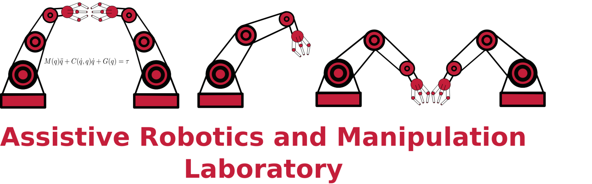
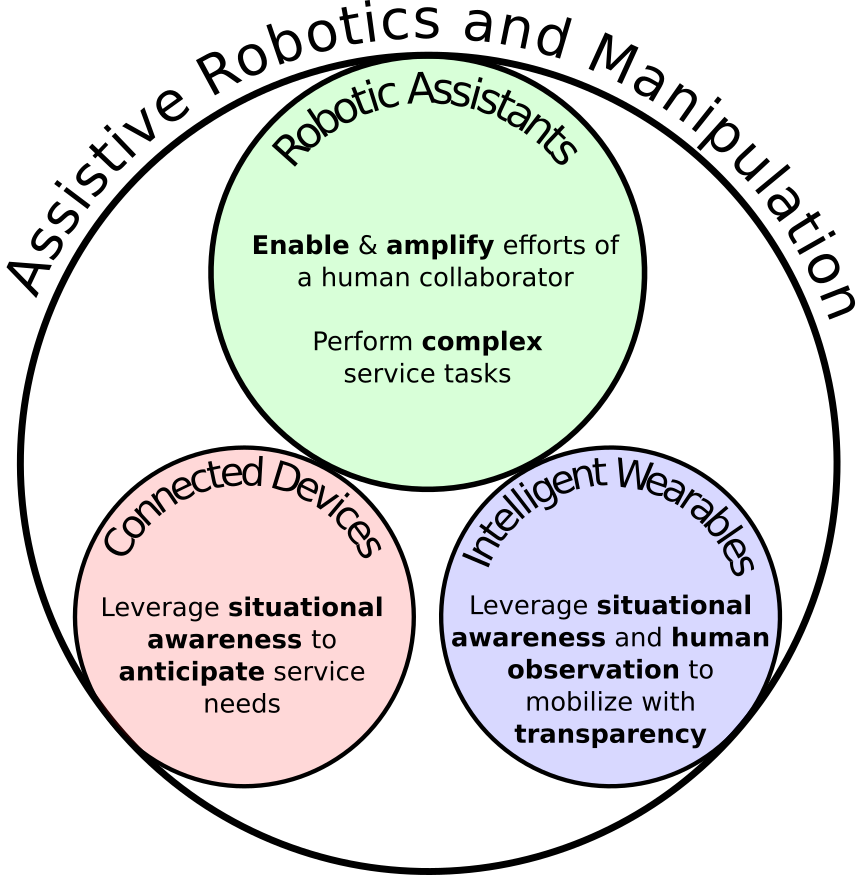
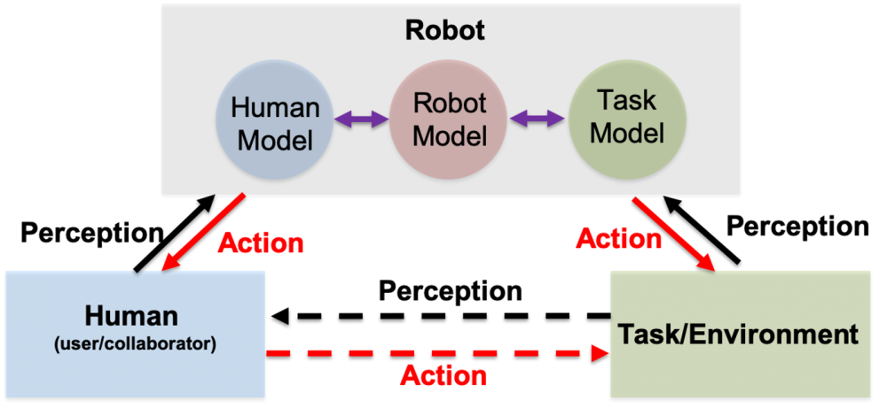

# Assistive Robotics and Manipulation Laboratory (ARMLab)

Our stanford domain is: [armlab.stanford.edu](https://arm.stanford.edu/">arm.stanford.edu)

<!--  -->

## ARMLab Research

The broad research objective of the Assistive Robotics and Manipulation Lab is to develop technology that improves everyday life by anticipating and acting on the needs of human counterparts. We specialize in developing intelligent robotic systems that can perceive and model environments, humans and tasks and leverage these models to predict system processes and understand their assistive role. The research can be divided into the following sub-categories: robotic assistants, connected devices and intelligent wearables.  We use a combination of tools in dynamical systems analysis, control theory (classical, non-linear and robust control), state estimation and prediction, motion planning, vision for robotic autonomy and machine learning. Our lab focuses heavily on both the analytical and experimental components of assistive technology design. While our application area domain is autonomous assistive technology, our primary focus is robotic assistants (mobile manipulators and humanoids) with the goal of deployment for service tasks that may be highly dynamic and require dexterity, situational awareness, and human-robot collaboration. 

<!--  -->

To be an effective teammate, the robot must be able to accurately model itself, the task and the human collaborator. 

<!--  -->

## Robotic Assistants

We define robotic assistants as robots that can autonomously, physically interact with their environment, and in often have mobility within their environment. Robots we commonly use are stationary manipulators (stationary robotic arms), mobile manipulators (robotic arms mounted on movable base) and humanoid robots (full arms and legs). Research problems in this category must either 
- Enable and amplify the efforts of a human collaborator
- Perform complex service tasks

Enabling and amplifying the efforts of a human collaborator require that the robotic assistant be able to perceive the task (situational awareness), understand the human collaborators operational goal (e.g.. determine if the human is trying to lift/move an object), and then understand its role in helping the human collaborator achieve the operational goal (e.g. how should the robot assist in lifting/moving the object to reduce the work of the human). 

For performing complex service tasks, we consider tasks that are complex in the sense that
- There may be many sequential steps without an easily measurable 'reward', which requires significant, insightful modeling to achieve. 
- There is high operational risk (not many attempts may be allowed in deployment)
- Require adaptivity in task modeling due to disturbances. Such disturbances could be either internal (such as error recovery), or external (third-party disturbance of the task elements)

Our goal is to equip the robotic assistant to model its task/environment, plan actions that allow for achieving the complex task, and control toward the objective with the ability to account for varying disturbances.

## Connected Devies

We consider connected devices as assistive technology when they are used to perform a service by leveraging collective knowledge about the environment and human user to take intelligent, service actions. The collective devices must leverage situational awareness to anticipate service actions.

A simplistic toy example in a house with connected devices would be the intelligent interaction between a phone, automated lights and a coffee maker, where the interaction with the phone at the beginning of the day allows the coffee maker to anticipate usage, and the path through the house to the coffee maker is illuminated. While this is a simplistic example, its components can be generalized and require the understanding of the humans' current action, the anticipation of the human's future action and an understanding of the situation or process leading to the next stage of service.    

## Intelligent Wearables

We define robotic wearables broadly as technology that directly augments the human user (e.g. prosthetic, exoskeleton or wheelchair).  As an assistive technology, we will develop intelligent wearables that leverage situational awareness (environment or task context) and human user observation to mobilize (allow or actively move the human) with transparency (the human feels virtually no resistance during motion or the motion was expected as the robotic system anticipated the desired motion). This approach differs from common approaches (which solely use sensory feedback either from sensory on-board the robot or sensors placed on the human), in that the ability for the robot to consider desired actions within the context of the environment or task allows the system to predict as oppose to just react. 

